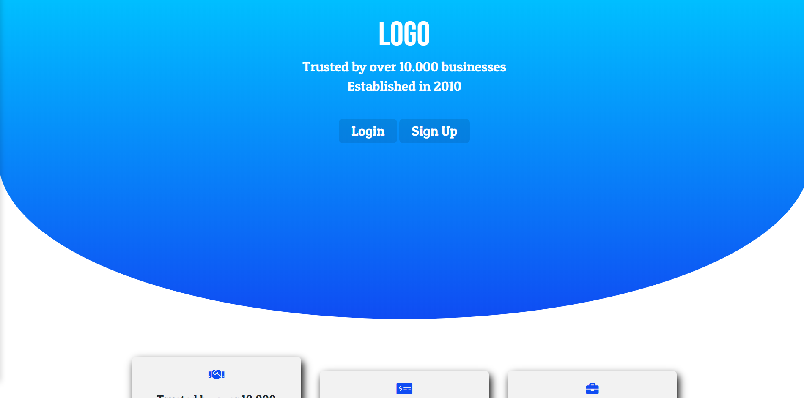

# Landing Page Template

## Preview


## ***Built With***:
- Javascript **(React, Vanilla and Jquery)**
- HTML
- CSS
- PHP

## ***Features***
- Landing page as index.html
- Login and signup to SQL database and table
- Salting and hashing
- Responsive Design

This template is available on my website as a static content, as github does not support dynamic pages.

## If you want to use this, follow the instructions:
#### Setup the Database, and the table
- Set up your own web server. (I use xampp).
- Make an SQL Database (*name it: **test***)
- Make a table (*name it: **Users***)
- Make 4 cloumns, in the following order: (**uname, pass, email, salt**)
#### Edit the script, so it will match your settings
- Edit these lines ↓↓↓ according to your settings: (both in **login and signup.php**)

```php  
define('DB_SERVER', 'localhost:3307');
define('DB_USERNAME', 'root');
define('DB_PASSWORD', '');
```

 ***After those steps, you are ready to try the script out.***
